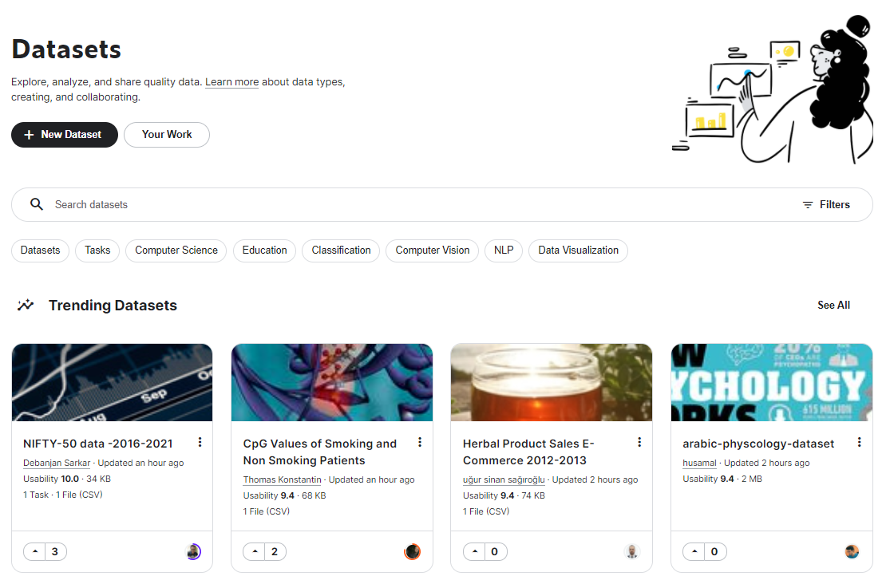

# RandomKaggleSolving

## Presentation

>Building deep learning models using kaggle datasets.

## Subjects (Click on title for dataset link)

### MLP :

1. [Heart attack prediction](https://www.kaggle.com/rashikrahmanpritom/heart-attack-analysis-prediction-dataset)
2. [Stroke prediction](https://www.kaggle.com/fedesoriano/stroke-prediction-dataset)

### CNN :

1. [Chest X-rays disease classification](https://www.kaggle.com/nih-chest-xrays/data)
